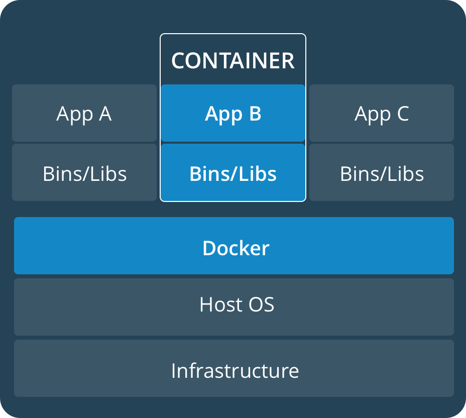
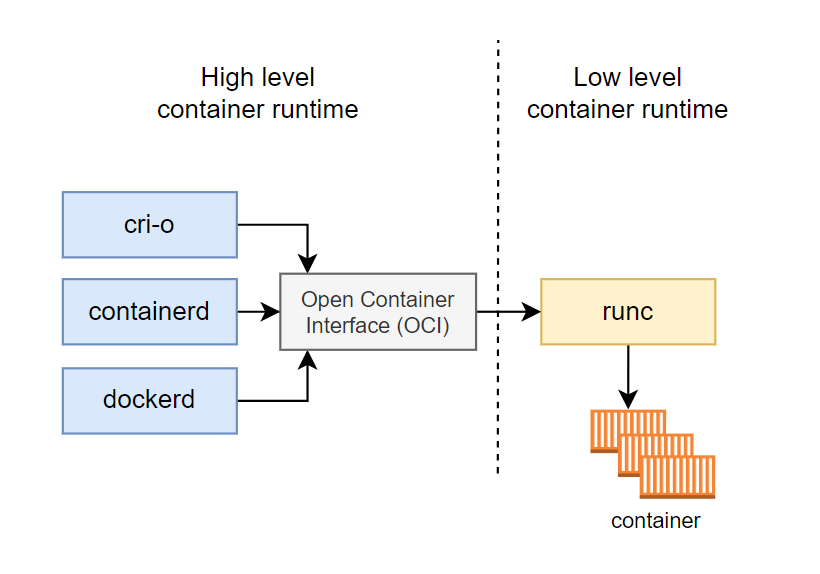
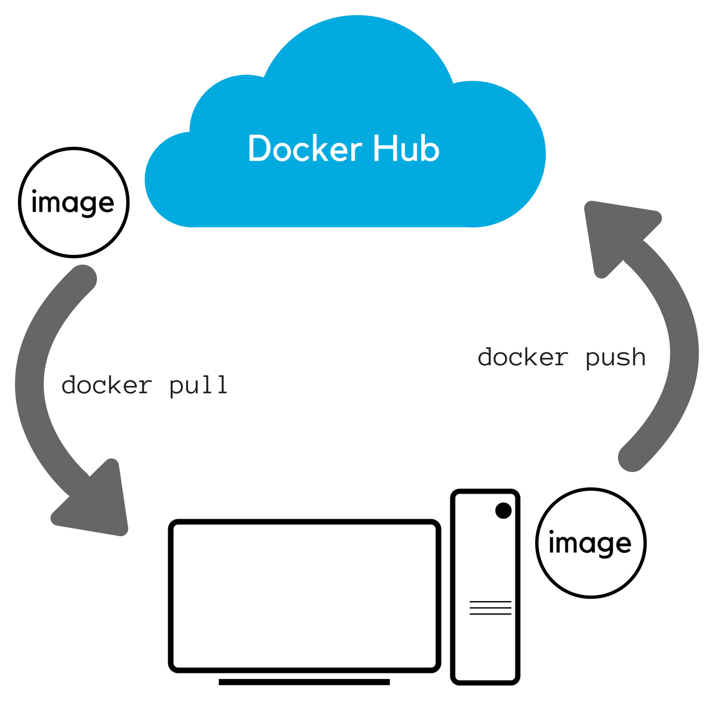

# Understanding Container Technologies

## Table Of Contents

- [Container](#container)
- [Container Runtime](#container_runtime)
- [Container Registry](#container_registry)
- [Container Image Formats](#container_image_formats)
- [Image Building](#image_building)
- [Image Running](#image_running)
  
## Container

A **container** is a lightweight package that holds everything an application needs to run. It includes the app's code, all the tools and libraries the app needs to work, and settings, ensuring the app runs the same way on any system. Containers help developers easily share and deploy applications without worrying about compatibility issues.

**Example**: Imagine you’re cooking a meal. You pack all the ingredients, the recipe, and the cooking tools into one box. Now, no matter where you go your kitchen, a friend’s house, or even a different country you can make the exact same meal because you have everything you need in that box.
In the same way, a container holds everything an app needs, so it will work the same no matter where you run it on your computer, a server, or in the cloud.

## 1. Container Runtime

A **container runtime** is the software responsible for running containers. In simple terms, it's like an engine that makes sure containers can start, stop, and manage themselves on your system.

**How does it work?**  

* Imagine you have a box containing an application and all its necessary files. The container runtime is responsible for opening that box, executing the application, and managing resources such as CPU and memory for the application.

* It also ensures the application is isolated from the rest of the system, so it can run without interfering with other applications on the machine.

**There are two types of container runtimes:**

1. **Low-level container runtimes (also called "OCI runtimes"):** These are the most basic container runtimes, responsible for directly interacting with the operating system to start and run containers. They don’t manage anything beyond launching containers.

* **Example:** runc, crun, Youki

* **How it works:** Think of it like an engine that powers a car. It doesn't care about the shape of the car or its design, it just runs it. These runtimes take instructions from higher-level tools, set up the container’s environment, and start the container.

**OCI**- OCI stands for **Open Container Initiative**. It’s an organization that creates standards for how containers should work, making it easier for different software tools to work together. 

2. **High-level container runtimes (also called "container management tools"):** These runtimes handle more than just starting a container. They manage the entire container lifecycle, including pulling container images, managing storage, networking, and sometimes even coordinating and organizing multiple containers to work together.

* **Example:** containerd, CRI-O
  
* **How it works:** Imagine a car, but this time you not only have an engine (low-level runtime) but also a dashboard that helps you control the car, manage fuel, speed, and even check the tire pressure. High-level runtimes work on top of low-level ones to make it easier to manage containers.

## 2. Container Registry

A **container registry** is like a storage space where container images are kept. These images are ready-to-use packages that contain everything needed to run a piece of software, like code, libraries, and settings.

**How it works:** 

* You build a container image (which is like creating a snapshot of your software environment).
  
* Then, you push (upload) that image to a container registry, where it's saved.

* Later, when you want to use that image (on another computer, or in a cloud), you can pull (download) it from the registry and run it.

Think of it like an app store for containers: you upload images (like apps) and others can download them when needed. Popular container registries include Docker Hub, Google Container Registry (GCR), and Amazon Elastic Container Registry (ECR).

## 3. Container Image Formats

Just like there are different formats for storing files (PDF for documents, JPG for photos), **container image formats** are the way container blueprints are packaged. These formats describe how the contents of a container (files, code, and everything an app needs) are organized and stored. The container image format ensures that these blueprints can be shared, moved, or run easily on any system that supports containers. The image format doesn’t change how the app works but helps systems understand how to run the app inside the container.

**Example:** Imagine if you had a cooking recipe book that came in a different format (print, PDF, or online). The format is different, but the instructions remain the same, so you can still cook the meal. Similarly, a container image format doesn’t change the app, but it organizes how the information is stored and used.
The most common container image format is OCI (Open Container Initiative), which ensures compatibility between different systems.

## 4. Image Building

**Image building** is the process of creating the container image, which is the blueprint or template of an app. It’s like following a recipe to bake a cake. You take all the ingredients (the app’s files, code, and necessary software) and pack them together in a way that makes them ready to run anywhere.
Once the image is built, it can be stored in a registry, so others can use it without needing to worry about how to set up or install the app. Building an image ensures that the app always runs in the same way, no matter where it’s used.

**Example:** Imagine you're baking a cake. You gather all the ingredients (flour, sugar, eggs), mix them according to the recipe, and bake it. Once the cake is baked, it’s ready for anyone to enjoy. Similarly, when you build a container image, you're preparing everything needed to run the app.
Tools like Docker are commonly used to build images.

**How it works:** 

1. **Starting with a Base:** Every image usually begins with a base layer, often a minimal version of an operating system (like Linux). It’s like laying the foundation of a house before adding the rooms and furniture.

2. **Adding Layers of Instructions:** Each step to prepare the software goes on top of this base, like adding floors to a building. For example, installing a programming language, copying files, or setting up specific configurations are each separate layers.

3. **Using a “Recipe” (Dockerfile):** A special file called a Dockerfile serves as the recipe. This file contains all the instructions for each layer, telling the system what to add, install, or configure. It’s a straightforward list of steps needed to get the application ready.

4. **Building Blocks (Layers):** Each layer is built on top of the last one, which keeps things organized. If one part (layer) changes, the system doesn’t have to rebuild everything, just the updated part, which saves time and resources.

5. **Final Image:** The end result is a single image that has everything needed for the application to run. Think of it as a box with all the tools, libraries, and files packed together so it’s ready to go anywhere.

## 5. Image Running

**Image running** is when you take a container image (the blueprint) and actually start it up so it can do its job. When the image runs, it becomes an active container (a working app).
The running container is isolated, meaning it doesn’t interfere with other apps or containers, even if they’re running on the same computer.

**Example:** Imagine you have a cake stored in your fridge (which is like the container image), and you decide to take it out, cut a slice, and eat it. When you "run" a container, you’re starting the app, just like enjoying the cake after you’ve stored it.

## Summary

The container ecosystem makes it easier and faster for developers to create and share applications. It uses special packages that include everything an app needs to run, ensuring that it works the same way no matter where it's used on a developer's computer, a server, or in the cloud.
Because of this, developers can build reliable and efficient applications without as many problems. This approach helps them work more quickly, find and fix fewer bugs, and ultimately provide a better experience for users.

   

